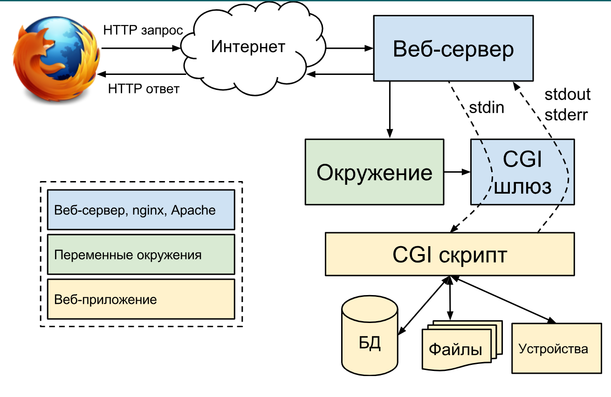

[Перелік усіх робіт](README.md)

# Лабораторна робота №2. Перевірка роботи CGI-застосувань

## Мета роботи

Перевірити можливість використання bat-файлів, як CGI-застосувань

## Обладнання

Персональний комп'ютер. Редактори коду Visual Studio Code, Sublime Text 3 або Notepad++. Пакет програм XAMPP або OSPanel. Web-браузер Chrome, Firefox, Opera, MS Edge.

## Теоретичні відомості

CGI (від англ. Common Gateway Interface - "загальний інтерфейс шлюзу") - стандарт інтерфейсу, що використовується для зв'язку зовнішньої програми з веб-сервером. Програму, яка працює за таким інтерфейсом спільно з веб-сервером, прийнято називати шлюзом, хоча багато хто віддає перевагу назвам «скрипт» (сценарій) або «CGI-програма».

Оскільки гіпертекст статичний за своєю природою, веб-сторінка не може безпосередньо взаємодіяти з користувачем. До появи JavaScript, не було іншої можливості відреагувати на дії користувача, крім передати введені ним дані на веб-сервер для подальшої обробки. У разі CGI ця обробка здійснюється за допомогою зовнішніх програм та скриптів, звернення до яких виконується через стандартизований (див. RFC 3875: CGI Version 1.1) інтерфейс – загальний шлюз.

Спрощена модель, що ілюструє роботу CGI:



### Як працює CGI?
Узагальнений алгоритм роботи через CGI можна подати у такому вигляді:

1. Клієнт запитує CGI-додаток з його URI.
2. Веб-сервер приймає запит та встановлює змінні оточення, через них додатку передаються дані та службова інформація.
3. Веб-сервер перенаправляє запити через стандартний потік введення (stdin) на вхід програми, що викликається.
4. CGI-додаток виконує всі необхідні операції та формує результати у вигляді HTML.
5. Сформований гіпертекст повертається веб-сервер через стандартний потік виведення (stdout). Повідомлення про помилки надсилаються через stderr.
6. Веб-сервер передає результати запиту клієнта.

## Хід роботи

1. Впевнитись, що пакет XAMPP встановлено та web-сервер Apache запущений
2. Перейти до каталогу `C:\xampp\htdocs\` та очистити його
3. В каталогу `C:\xampp\htdocs\` створити файли з іменем `.htaccess` та `index.bat`
4. Відкрити `.htaccess` та записати туди наступні налаштування серверу та зберегти файл

```htaccess
ScriptInterpreterSource Registry-Strict 
AddHandler cgi-script .bat 
Options +ExecCGI +FollowSymlinks 
```
5. Відкрити `index.bat` та записати туди наступний код інтерпритатору командного рядка та зберегти файл

```bat
@echo off
echo Content-type: text/plain
echo.
dir
```

6. Перейти за адресою `http://127.0.0.1/index.bat` або `http://localhost/index.bat` та впевнитись, що завантажився результат роботи консольної команди `dir`
7. Profit! Ви щойно налаштували виконання Batch-сценаріїв, як веб-застосування
8. Відкрити `.htaccess` та додати туди наступні налаштування серверу:

```htaccess
AddHandler cgi-script .exe
```

9. Створити консольний проект на Delphi. Написати наступну програму \*

```delphi
program Project1; 

{$APPTYPE CONSOLE} 

{$R *.res} 

uses 
System.SysUtils; 

begin 
try 
    { TODO -oUser -cConsole Main : Insert code here } 
    Write('Content-Type: text/plain'); 
    Writeln(''); 
    Writeln(''); 
    Write('hello world!'); 
except 
    on E: Exception do 
    Writeln(E.ClassName, ': ', E.Message); 
end; 
end. 
```

10. Зберегти проект та зкомпілювати виконуваний файл `project1.exe`
11. Помістити файл `project1.exe` до каталогу `C:\xampp\htdocs\`
12. Перейти за адресою `http://127.0.0.1/project1.exe` або `http://localhost/project1.exe` та впевнитись, що завантажився результат роботи консольної програми `project1.exe`
13. Перевірити чи встановлено на комп'ютер інтерпритатор мови Python. У разі необхідності встановити його самостійно
14. Створити самостійно CGI-сценарій на Python, який виводить числа від 1 до 10 \*\*
15. Перевірити роботу сценарію через HTTP-запит
16. Для кожного етапу роботи зробити знімки екрану та додати їх у звіт з описом кожного скіншота
17. Додати програмний код завдання для самомтійного виконання
18. Дати відповіді на контрольні запитання
19. Зберегти звіт у форматі PDF

## Контрольні питання

1.  Що таке CGI?
2.  Як додати до веб-серверу можливість виконувати застосування на мові perl?
3.  В яких випадках застосовують CGI?
4.  Які режими роботи PHP ви можете назвати?
5.  Яка особливість роботи PHP в режимі CGI?
6.  Чи можливо перенести CGI-застосування на мові С++ з платформи Windows на Linux. Коротко поясніть як і чому?


## Довідники та додаткові матеріали

1.  [Режими роботи PHP](https://hostiq.ua/wiki/ukr/php-modes/)
2.  [Комплексний довідник web-розробника](https://www.w3schools.com/)
3.  [CGI](https://lectureswww.readthedocs.io/5.web.server/cgi.html)
4.  [Common Gateway Interface (CGI)](https://www.geeksforgeeks.org/common-gateway-interface-cgi/)
5.  [Apache Tutorial: Dynamic Content with CGI](https://httpd.apache.org/docs/2.4/howto/cgi.html)
6.  [How to run CGI on XAMPP?](https://community.apachefriends.org/f/viewtopic.php?p=123854)
7.  [Apache HTTP Server Tutorial: .htaccess files](https://httpd.apache.org/docs/trunk/howto/htaccess.html)


## Примітки
* \* - код надано на мові Delphi 2010
* \*\* - дозволяється використання коду інших розробників
