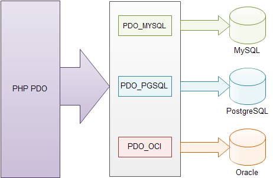

[Перелік усіх робіт](README.md)

# Лабораторна робота №12. Використання PDO для обміну даними з СКБД

## Мета роботи

Вивчити принципи підключення та виконання запитів до СКБД з використанням драйвера PDO.

## Обладнання

Персональний комп'ютер. Пакет програм XAMPP. Текстовий редактор Sublime Text 3 або IDE NetBeans. Web-браузер Chrome, Firefox, Opera

## Теоретичні відомості

PDO (PHP Data Objects) - це розширення для мови програмування PHP, яке надає зручний і безпечний спосіб взаємодії з реляційними базами даних. PDO дозволяє PHP-розробникам використовувати однаковий інтерфейс для роботи з різними системами управління базами даних, такими як MySQL, PostgreSQL, SQLite, Oracle та інші. Він служить абстракцією бази даних і надає безпечні запити до бази даних, запобігаючи атакам SQL-ін'єкції.

PDO та MySQLi - це два основних способи взаємодії з базами даних MySQL в PHP, але PDO в порівнянні з MySQLi має ряд переваг:

1. Підтримка різних СУБД: PDO підтримує багато різних систем управління базами даних (СУБД), включаючи MySQL, PostgreSQL, SQLite, Oracle та інші. Це означає, що ви можете використовувати один і той самий код для взаємодії з різними СУБД, змінюючи лише параметри підключення.
2. Параметризовані запити: PDO сприяє безпеці, оскільки він полегшує використання параметризованих запитів, що допомагає запобігти атакам SQL-ін'єкції. У MySQLi також є можливість використовувати параметризовані запити, але синтаксис може бути трохи складнішим.
3. Об'єктно-орієнтований інтерфейс: PDO надає об'єктно-орієнтований інтерфейс для взаємодії з базою даних, що спрощує роботу з кодом та покращує його читабельність.
4. Підтримка транзакцій: PDO має вбудовану підтримку транзакцій, що дозволяє вам виконувати кілька запитів як єдину транзакцію, яку можна відкотити (ROLLBACK) або підтвердити (COMMIT) за необхідності. У MySQLi також є підтримка транзакцій, але її використання може бути складнішим.
5. Інші функції та можливості: PDO має деякі інші корисні можливості, такі як підтримка роботи з різними типами даних (наприклад, об'єктами та масивами), що може бути зручним для розробників.

## Хід роботи

1. Впевніться, що пакет XAMPP встановлено та web-сервер Apache запущений
2. Перейдіть до каталогу `C:\xampp\htdocs\` та очистіть його
3. Виконайте приклади наведені нижче. Зверніть увагу на дані підключення до СКБД!
4. Опрацюйте лабораторні роботи № 8 та № 11
5. У вже виконаних завданнях змініть драйвер бази даних з MySQLi на PDO
6. Відредагуйте запити до СКБД так, щоб вони працювали з драйвером PDO
7. Додайте до вашої роботи таблицю з користувачами, що містить наступні дані:
   - Ідентифікатор користувача (PK)
   - Ім'я входу - логін (унікальне)
   - Прізвище та ім'я
   - Електронна пошта
   - Пароль
8. Додайте до вашої роботи можливість перегляду списку книг тільки для авторизованих користувачів
9. Додайте можливість виходу з авторизованої сесії
10. Додайте до вашої роботи елемент безпеки: зробіть так, щоб пароль у базі даних зберіхався у вигляді хешу. Можна використати MD5, але зверніть увагу, що наразі дана функція не вважається криптостійкою, тому бажано використати іншу
11. Впевніться, що всі вихідні HTML-сторінки є валідними, використавши валідатор HTML-коду [validator.w3.org](https://validator.w3.org/). За необхідності, виправити помилки та зауваження
12. Для кожного етапу роботи зробіть знімки екрану та додайте їх у звіт з описом кожного скіншота
13. Додайте програмний код завдання для самомтійного виконання
14. Дайте відповіді на контрольні запитання
15. Збережіть звіт у форматі PDF

## Приклади

1. [Додавання користувачів](src/lab-12/users1.php)
2. [Перегляд списку користувачів](src/lab-12/users2.php)
3. [Перегляд одного користувача](src/lab-12/users3.php)
4. [Авторизація користувача](src/lab-12/auth1.php)

## Контрольні питання

1.  Що таке PDO і для чого воно використовується в PHP?
2.  Які переваги надає використання PDO в порівнянні з іншими методами взаємодії з базами даних?
3.  Які типи баз даних підтримуються PDO?
4.  Як створити підключення до бази даних за допомогою PDO?
5.  Як відбувається обробка помилок та винятків при використанні PDO?
6.  Що таке параметризовані запити і як їх використовувати за допомогою PDO?
7.  Як використовувати підготовлені запити для підвищення безпеки та продуктивності?
8.  Як вивести результати запиту у вигляді асоціативного масиву або об'єктів з PDO?

## Довідники та додаткові матеріали

1. [Объекты данных PHP](https://www.php.net/manual/ru/book.pdo.php)
2. [PHP + PDO. Работа с MySQL](https://www.youtube.com/watch?v=a9l3QPMqZ1Q)
3. [PHP md5()](https://www.php.net/manual/ru/function.md5.php)
4. [Функции Hash](https://www.php.net/manual/ru/ref.hash.php)