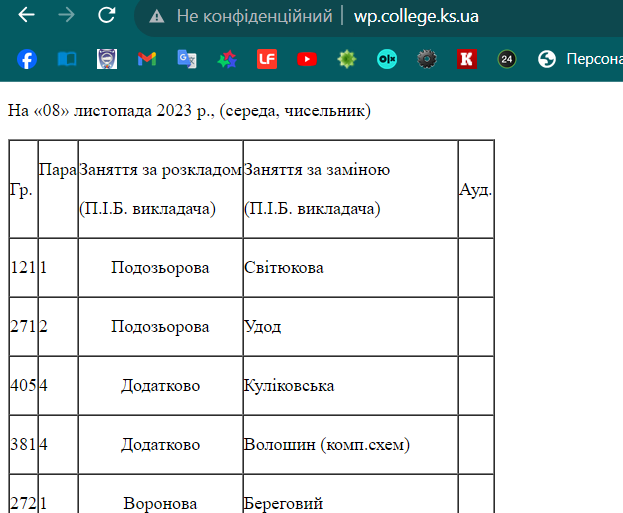

[Перелік усіх робіт](README.md)

# Лабораторна робота №13. Створення класів та екземплярів класів

## Мета роботи

Навчитися створювати класи та працювати з екземплярами класів. Навчитися обробляти контент HTML-сторінок

## Обладнання

Персональний комп'ютер. Пакет програм XAMPP. Текстовий редактор Sublime Text 3 або IDE NetBeans. Web-браузер Chrome, Firefox, Opera

## Теоретичні відомості

### Класи та екземпляри класів

Класи та екземпляри класів є ключовими поняттями в об'єктно-орієнтованому програмуванні (ООП).

1. Клас:
	- Клас - це шаблон або визначення для створення об'єктів.
	- Він визначає структуру та поведінку об'єктів, які будуть створені на його основі.
	- Клас містить поля (змінні) та методи (функції), які описують властивості та операції, які об'єкти цього класу можуть виконувати.
2. Екземпляр класу (об'єкт):
	- Екземпляр класу, також відомий як об'єкт, є конкретною реалізацією класу.
	- Він представляє окремий об'єкт, створений на основі класу, зі своїми власними унікальними даними та станом.
	- Об'єкти відповідають за виконання операцій та взаємодію з іншими об'єктами.

Основні відмінності між класами та їхніми екземплярами:
1. Клас - це абстракція, опис того, як створювати об'єкти певного типу. Він містить опис структури та поведінки об'єктів.
2. Екземпляр класу - це конкретний об'єкт, створений на основі класу. Кожен екземпляр має свій власний стан та дані, але спадковує властивості та методи від класу.

### Властивості та методи

Для створення класу в PHP використовується ключове слово class. У файлі index.php створимо новий клас, що представляє користувача: 

```php 
class User
	{
	}	
```

Щоб створити об'єкт класу User, застосовується ключове слово new:

```php
<?php
class User
    {
    }
$user = new User;
print_r($user);
?>   		
```

В описі класу можуть бути присутні властивості та дії, які може виконувати екземпляр класу. Такі дії називають методами:   

```php
<?php
class User
{
    public $name, $age;
	function getInfo()
	{
		echo "Ім'я: $this->name; Вік: $this->age <br>";
	}
}
$user = new User; // Створення екземпляра класа User
// Отримуємо доступ до членів класу
$user->name = "Tom";
$user->age  = 30;
$user->getInfo();
print_r($user);
?>	
```

Зверніть увагу на використання модифікаторів доступу: 
 + private - доступні тільки всередині об'єктів цього класу, недоступні в об'єктах класів-спадкоємців;
 + protected - доступні всередині об'єктів цього класу і всіх об'єктах класів-спадкоємців. При цьому недоступні ззовні;
 + public - доступні як всередині об'єктів класу, так і зовні - можемо безпосередньо звертатися до них ззовні. Доступні об'єктам класів-спадкоємців.

### Конструктори та деструктори

Конструктор - це метод класу, який автоматично викликається під час створення нового екземпляра класу (об'єкта). Конструктор використовується для ініціалізації властивостей та ресурсів об'єкта перед тим, як він буде використовуватися.

>Конструктор в PHP це функція з зарезервованим ім'ям `__construct()`.

Розглянемо детальніше роботу уніфікованого конструктора. Створимо файл Human.php в який помістимо клас з одноіменною назвою

```php
<?php
class Human
{
    public $name;
	public $city;
	public $age;
    function  __construct($nameofperson, $ageofperson)
    {
		$this->name = $nameofperson;
		$this->age = $ageofperson;
		$this->city = "Київ";
    }
}

$firstObject = new Human("Іван", 23);
$secondObject = new Human("Ярослав", 35);
?>
```

Відповідно до основ ООП PHP конструктор можна викликати НЕ більше одного разу, але ми можемо змінювати значення змінних-членів. Тому в класі Human створіть два методи, один встановлює вік, а другий - ім'я. 

Деструктор - це метод класу, який автоматично викликається під час звільнення ресурсів об'єкта, коли він виходить з області видимості або коли викликається функція unset.
Використовується для звільнення ресурсів, таких як закриття файлу, роз'єднання з базою даних, якщо це потрібно.

>Деструктор визначається як метод `__destruct()`. 

Коли звільняється останнє посилання на об'єкт, перед вивільненням пам'яті, що займає цей об'єкт, викликається метод-деструктор, який не приймає параметрів.

```php
<?php
class Car
{
	function __construct()
	{
		print "Constructor";
		$this->name = "Car";
	}
	function __destruct()
	{
		print "Destroying " . $this->name;
	}
}
$obj = new Car();
?>
```

Цей деструктор виводить повідомлення про те, що об'єкт був знищений.

**Зауваження!** Деструктор так само, як і конструктор, викликається тільки один раз - в момент видалення об'єкта.


## Хід роботи
1. Впевнитись, що пакет XAMPP встановлено та web-сервер Apache запущений
2. Перейти до каталогу `C:\xampp\htdocs\` та очистити його
3. Розгляньте приклад 1, де клас `WebPageScraper` створено як універсальний інструмент завантаження та синтаксичного розбору сторінки web-сайту. У випадку правильної роботи сценарію, ви маєте отримати наступний результат:
   
4.  Вдоскональте клас та виконайте наступні задачі:
    1.  Виведіть останню додану на сайт коледжу новину
    2.  Виведіть розклад на поточний семестр
    3.  Підключіть до створеного проекту стилі та оформіть зовнішній вигляд вашої сторінки
    4.  За допомогою класу WebPageScraper виведіть поточну погоду. Інформацію зпарсіть з сайту `https://weather.com/`. У випадку правильної роботи сценарію, ви маєте отримати наступний результат:
   
    5.  За допомогою стилів оформіть зовнішній вигляд сторінки. Для графічних позначень використайте зображення.
5.  Впевніться, що всі вихідні HTML-сторінки є валідними, використавши валідатор HTML-коду [validator.w3.org](https://validator.w3.org/). За необхідності, виправити помилки та зауваження
6.  Для проекту створіть папку "lab 13" в своєму репозиторії "web-progr" на Github. Завантажте кінцеві файли лабораторної роботи. 
7.  Для кожного етапу роботи зробіть знімки екрану та додайте їх у звіт з описом кожного скіншота
8.  Додайте програмний код завдання для самомтійного виконання
9.  Дайте відповіді на контрольні запитання
10. Додайте в кінці звіту посилання на репозиторій та папку з лабораторною роботою
11. Збережіть звіт у форматі PDF
12. Додайте звіт до репозиторія

## Приклади

1. [Приклад 1. Головний модуль](src/lab-13/index.php)
2. [Приклад 1. Клас WebPageScraper](src/lab-13/WebPageScraper.php)

## Контрольні питання
1. Що таке клас та екземпляр класу в ООП?
2. Коли відбувається ініціалізація властивостей класу?
3. Для чого використовується вказівник `$this`?
4. Як можна викликати батьківський конструктор в конструкторі дочірнього класу?
5. За допомогою якого методу доступа можна отримати доступ з поточного та дочірнього класу?
6. Якою функцією можна імітувати роботу деструктора?
7. Для чого призначений оператор new?

## Довідники та додаткові матеріали

1. [Объекты данных PHP](https://www.php.net/manual/ru/book.pdo.php)
2. [PHP + PDO. Работа с MySQL](https://www.youtube.com/watch?v=a9l3QPMqZ1Q)
3. [PHP md5()](https://www.php.net/manual/ru/function.md5.php)
4. [Функции Hash](https://www.php.net/manual/ru/ref.hash.php)
5. [Session Handling](https://www.php.net/manual/en/book.session.php)
6. [PHP Sessions](https://www.w3schools.com/php/php_sessions.asp)

