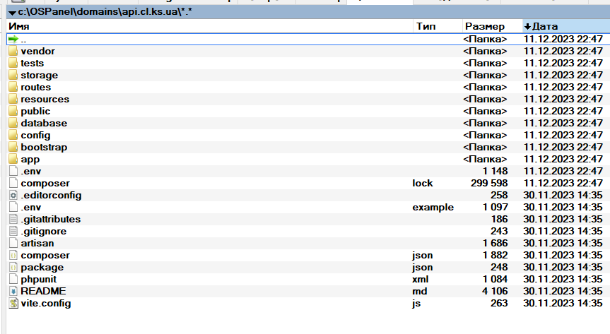
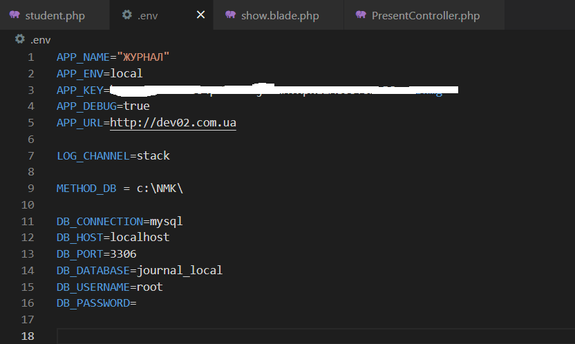

[Перелік усіх робіт](README.md)

# Лабораторна робота №21. Створення порожнього проекту на базі фреймворку Laravel

## Мета роботи

Навчитися працювати з моделями, розділяти проєкт на структурні частини, використовувати файли конфігурації для збереження налаштувань проекту.

## Обладнання

Персональний комп'ютер. Пакет програм XAMPP. Текстовий редактор Sublime Text 3 або IDE NetBeans. Web-браузер Chrome, Firefox, Opera

## Теоретичні відомості

### Laravel


Laravel — безкоштовний, з відкритим кодом PHP-фреймворк, створений Тейлором Отвелом (англ. Taylor Otwell) і призначений для розробки вебдодатків відповідно до шаблону model–view–controller (MVC).

Серед особливостей Laravel можна назвати: модульну систему упакування з виділеним менеджером залежностей Composer; різні способи для доступу до реляційних баз даних; утиліти, які допомагають в розгортанні додатків і технічного обслуговування; орієнтація на синтаксичний цукор.

Станом на березень 2015 року, Laravel вважався одним з найпопулярніших PHP фреймворків, разом з Symfony5, Nette, CodeIgniter, Yii2 та іншими.

### Composer


Composer — менеджер пакетів прикладного рівня для мови програмування PHP що забезпечує стандартний формат для управління залежностями у програмному забезпеченні та необхідними бібліотеками. Він був розроблений Нілом Адерманом і Хорді Боггіано, які і досі супроводжують проект. Вони почали розробку в квітні 2011 року і вперше випустили його 1 березня 2012 року.[1] Composer брав натхнення з «npm» для Node.js і «bundler» для Ruby's.[3] Спочатку в основі був алгоритм залежностей проекту з openSUSE's libzypp.[4]

Composer працює з командного рядка і встановлює залежності (наприклад, бібліотек) для застосунку. Він також дозволяє користувачам встановлювати PHP пакети, доступні на «Packagist»[5], який є його основним сховищем, яке містить доступні пакети. Він також реалізує автозавантажувач класів, для встановлених бібліотек і це полегшує використання коду від сторонніх розробників.

Composer використовується як складова частина декількох популярних PHP проектів з відкритим вихідним кодом, наприклад: Laravel, Symfony.

### Packagist

Packagist - це централізований реєстр пакетів для мови програмування PHP. Його можна порівняти з централізованими репозиторіями пакетів інших мов, таких як npm для Node.js, RubyGems для Ruby або PyPI для Python. Packagist є основним джерелом пакетів для Composer, який є менеджером залежностей для PHP.

Основні характеристики Packagist:

1. Реєстр пакетів: Packagist містить велику кількість PHP-пакетів, які ви можете використовувати у своїх проектах. Ці пакети можуть бути фреймворками, бібліотеками або іншими корисними компонентами, які спрощують розробку.

2. Composer: Composer є інструментом для управління залежностями PHP-проектів і використовує Packagist як основний ресурс для пошуку та завантаження пакетів. Він дозволяє легко додавати, видаляти та оновлювати залежності в проекті.

3. Автори та співробітництво: Розробники можуть публікувати свої пакети на Packagist, щоб інші розробники могли їх використовувати. Це сприяє спільноті та обміну кодом у PHP-екосистемі.

4. Широкий вибір пакетів: На Packagist можна знайти різноманітні пакети для різних потреб, починаючи від фреймворків і закінчуючи використанням для конкретних завдань.

Для використання Packagist і Composer у своїх проектах, вам просто потрібно вказати залежності у файлі composer.json та викликати composer install для встановлення всіх необхідних пакетів.

### Створення нового проекту на Laravel

Створіть новий віртуальних хостинг для свого вебсервера.

Змініть файл `C:\Windows\System32\drivers\etc` наступним чином: додайте до нього доменне ім'я, за яким ви будете звертатися до хостинга.

```hosts
127.0.0.1  laravel.test
```

Налаштуйте Apache наступним чином: додайте новий віртуальних хост у файл конфігурації `C:\xampp\apache\conf\extra\httpd-vhosts.conf`/

```
<VirtualHost laravel.test:80>
    DocumentRoot "C:/xampp/htdocs/laravel_test/public"
</VirtualHost
```

Перезапустіть веб-сервер.

Для створення проекту у каталогу віртуального хоста `laravel_test` виконайте команду

```sh
composer create-project --prefer-dist laravel/laravel .
```
Якщо Composer встановлено і він працює коректно, то має відбутися завантаження фреймворку та демонстрація ходу встановлення.


Каталог з проектом після встановлення матиме приблизно наступний вміст:



Перейдіть за адресою `http://laravel.test`. Якщо все виконано вірно, то ви маєте побачити сторінку вітання порожнього фреймворку.


### Налаштування проекту Laravel

Базові налаштування проєкту відбуваються за допомогою файлу `.evn`, що знаходиться у корні папки проекту.



### Структура фреймворку Laravel

Спрощено структура фреймворка виглядає наступним чином

1. app:
   - Console: Команди Artisan.
   - Exceptions: Обробники винятків та розширення виняткових класів.
   - Http:
     - Controllers: Контролери для обробки HTTP-запитів.
     - Middleware: Посередники, які обробляють HTTP-запити перед їх потраплянням в контролер.
     - Requests: Класи для обробки валідації та обробки HTTP-запитів.
   - Providers: Постачальники сервісів для реєстрації сервісів у додатку.

2. bootstrap:
   - Cache: Кешовані файли для оптимізації завантаження фреймворку.
   - App.php: Файл ініціалізації фреймворку.

3. config:
   - Конфігураційні файли для різних складових фреймворку та додатків.

4. database:
   - Migrations: Міграції для оновлення бази даних.
   - Seeders: Класи для наповнення бази даних тестовими даними.

5. public:
   - Всі зовнішні файли, які будуть доступні публічно (CSS, JavaScript, зображення, і т.д.).

6. resources:
   - assets: Неспаковані ресурси, такі як LESS, SASS, або CoffeeScript.
   - lang: Файли локалізації.
   - views: Blade-шаблони для представлень.

7. routes:
   - web.php: Маршрути для веб-додатку.
   - api.php: Маршрути для API.

8. storage:
   - app: Тимчасові файли, створені вашим додатком.
   - framework: Різні файли, такі як кеш, журнали та інше.
   - logs: Журнали додатка.

9. tests:
   - Тести для вашого додатку.

10. vendor:
    - Залежності та бібліотеки, встановлені Composer.

11. .env:
    - Файл оточення для конфігурації оточення, таких як база даних, ключі доступу тощо.

12. artisan:
    - Консольна команда для виконання різних завдань, таких як генерація коду, міграції та інше.


## Хід роботи
1. Завантажте та встановіть пакетний менеджер Composer. Перезавантажте Windows
2. Впевнитись, що пакет XAMPP встановлено та web-сервер Apache запущений
3. Перейти до каталогу `C:\xampp\htdocs\`. 
4. За інструкцією в теоретичних відомосях створіть проект на Laravel. Доменне ім'я та назву папки проєкту оберіть відповідно до свого варіанту завдання.
5. Впевніться, що установка пройшла успішно і фреймворк запускається
6.  Для проекту створіть новий репозиторій "web-progr-laravel" на Github. 
7.  Ініціюйте папку з проєктом, як репозиторій Git. Підключіть локальний репозиторій до репозиторію на Github.
8.  Вивантажте проект на Github.
9.  Для кожного етапу роботи зробіть знімки екрану та додайте їх у звіт з описом кожного скіншота
10. Додайте програмний код завдання для самомтійного виконання
11. Дайте відповіді на контрольні запитання
12. Додайте в кінці звіту посилання на репозиторій з лабораторною роботою
13. Збережіть звіт у форматі PDF
14. Додайте звіт до репозиторія

## Приклади

1. [Приклад 1. Папка проекту](src/lab-20/)


## Контрольні питання

1. Що таке Composer?
2. Яка основна функція Composer у світі PHP-розробки?
3. Що таке файл composer.json і яку роль він виконує в проекті?
4. Що таке Laravel?
5. Як встановити Laravel за допомогою Composer?
6. Яка структура каталогів у Laravel і яку роль вони виконують?
7. Що таке Artisan і які основні команди Artisan використовуються при розробці?
8.  Які кроки потрібно виконати для створення нового Laravel-проекту?
9.  Чому важливо правильно налаштовувати файли .env у Laravel?


## Довідники та додаткові матеріали

1. [Laravel](https://laravel.com/)
2. [COMPOSER A Dependency Manager for PHP](https://getcomposer.org/)
3. [Packagist](https://packagist.org/)
4. [Laravel installation](https://laravel.com/docs/4.2)


## Альтернатвні теми за варіантами

Варіяант для виконання самостійних завдань

1. Каталог товарів продуктового магазину
2. Каталог книг у бібліотеці
3. Дошка оголошень
4. Фотогалерея
5. Каталог запчастин автомобілів
6. Індивідуальний електронний записник
7. Каталог рієлтора
8. Каталог бази будівельних матеріалів
9. Власний блог
10. Розклад маршрутів автовокзалу