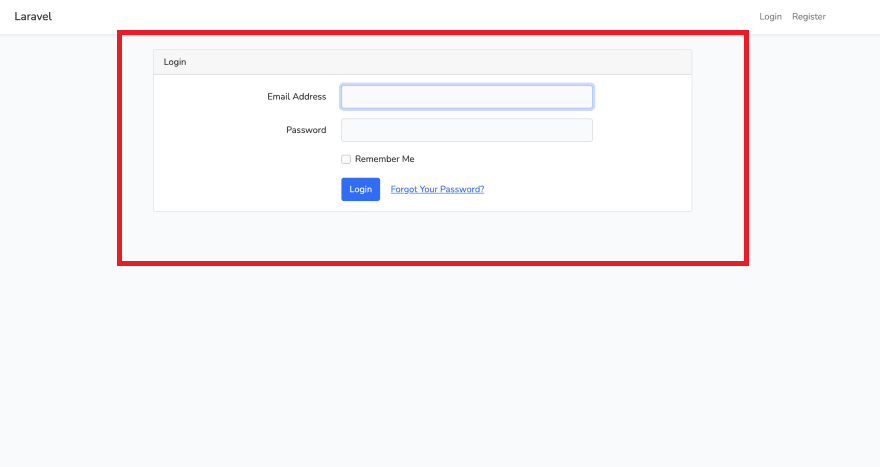

[Перелік усіх робіт](README.md)

# Лабораторна робота №23. Зв'язування моделей між собою. Підключення пакету Laravel UI

## Мета роботи

Навчитися працювати з моделями, розділяти проєкт на структурні частини, використовувати файли конфігурації для збереження налаштувань проекту.

## Обладнання

Персональний комп'ютер. Пакет програм XAMPP. Текстовий редактор Sublime Text 3 або IDE NetBeans. Web-браузер Chrome, Firefox, Opera

## Теоретичні відомості


### NPM

npm (Node Package Manager) — це пакетний менеджер для JavaScript, який використовується для управління залежностями та розповсюдження пакетів коду для проектів, заснованих на Node.js. npm є стандартним інструментом для розробки JavaScript, особливо під час створення веб-додатків з використанням фреймворків, таких як React, Angular або Vue.js.


Основні функції та можливості npm включають:

Установка пакетів:
Ви можете встановлювати залежності для вашого проекту, запускаючи команди типу:

```sh
npm install package-name
```

Це завантажить та встановить пакети у папку node_modules вашого проекту.

1. Локальні та глобальні пакети:
npm дозволяє встановлювати пакети локально (для конкретного проекту) або глобально (для всіх проектів на комп'ютері). Це корисно, коли ви встановлюєте інструменти розробки, такі як лінтери або фреймворки.

2. Управління версіями пакетів:
npm дозволяє вам визначати версії пакетів, щоб уникнути проблем із сумісністю. Ви можете встановлювати конкретні версії або дозволяти встановлювати останні стабільні версії.

3. Робота з файлом package.json:
Ваш проект може містити файл package.json, де зазначається список залежностей, скриптів для запуску різних задач, інформації про проект та його автора.

4. Скрипти та команди:
Ви можете використовувати npm для виконання скриптів, які вказані в вашому файлі package.json. Наприклад, команда npm run build може викликати скрипт для збірки вашого проекту.

5. Публікація пакетів:
Розробники можуть публікувати свої пакети в реєстрі npm, щоб інші розробники могли встановлювати та використовувати їх.

Основний реєстр npm містить тисячі пакетів, доступних для використання розробниками по всьому світу.


### Laravel UI

Laravel UI — це офіційний пакет Laravel, який надає засоби для швидкого створення базового інтерфейсу користувача (UI) в Laravel додатках. Цей пакет забезпечує можливість встановлення та налаштування різних популярних фронтенд фреймворків, таких як Bootstrap, Vue.js, React та інших.

Зазвичай Laravel UI використовується для створення аутентифікаційної системи, форм реєстрації та входу, забули пароль, а також для включення фронтенд фреймворків у проект.



Основні функціональності Laravel UI включають:

1. Аутентифікація:
Laravel UI може допомогти вам швидко встановити аутентифікаційну систему з входом, реєстрацією та відновленням паролю.

2. Vue.js, React, Bootstrap:
Laravel UI дозволяє вам вибрати, який фронтенд фреймворк ви хочете використовувати, такий як Vue.js, React або Bootstrap, і відповідно налаштувати ваш проект.

3. Інтеграція фронтенду та бекенду:
Засоби, які надає Laravel UI, допомагають інтегрувати ваш фронтенд та бекенд зручним способом, спрощуючи рутинні завдання.

4. Швидке встановлення:
Laravel UI має команди Artisan, які дозволяють швидко встановити та налаштувати всі необхідні ресурси для вибраного фронтенд фреймворку.

Приклад встановлення для Bootstrap:

```sh
composer require laravel/ui
php artisan ui bootstrap --auth
npm install && npm run dev
```

## Хід роботи
1. Впевнитись, що пакет XAMPP встановлено, web-сервер Apache запущений, віртуальний хост сворено та на ньому розгорнений фреймворк Laravel
2. Перейти до каталогу `C:\xampp\htdocs\laravel_test`, який було створено у ЛР 21 та ЛР 22. 
3. Впевніться, що установка пройшла успішно і фреймворк запускається
4. Відповідно до тематики вашої роботи, встановіть двосторонні відношення міш моделями.
5.  Встановіть за допомогою Composer пакет Laravel UI та згенеруйте форми авторизації на базі фреймворку `Bootstrap`. 
6.  Встановіть менеджер пакетів `NPM`.
7.  Ініціюйте npm у вашому проєкті та зберіть інтерфейс за допомогою команди `npm run build`.
8.  Впевніться, що авторизація працює, перейдіть за посиланням `http://laravel.test/login`.
9.  Зафіксуйте зміни в проєкті та аивантажте проєкт на Github.
10. Для кожного етапу роботи зробіть знімки екрану та додайте їх у звіт з описом кожного скіншота.
11. Дайте відповіді на контрольні запитання
12. Додайте в кінці звіту посилання на репозиторій з лабораторною роботою
13. Збережіть звіт у форматі PDF
14. Додайте звіт до репозиторія

## Приклади

1. [Папка порожнього проекту (без підкаталога vendor)](src/lab-21/)


## Контрольні питання

1. Що таке Laravel UI і яку роль він відіграє в розробці на Laravel?
2. Як встановити Laravel UI та які можливості він пропонує для вибору фронтенд фреймворку?
3. Як використовувати Laravel UI для швидкої інтеграції аутентифікаційної системи у Laravel-додатку?
4. Що таке npm?
5. Які базові команди npm використовуються для управління пакетами у npm?
6. Як встановити локальні та глобальні пакети за допомогою npm?
7. Як використовувати файл package.json та які його основні функції у контексті npm?
8. Як встановити відношення між моделямі Laravel?


## Довідники та додаткові матеріали

1. [Laravel](https://laravel.com/)
2. [Eloquent: Getting Started](https://laravel.com/docs/10.x/eloquent)
3. [Eloquent: Relationships](https://laravel.com/docs/10.x/eloquent-relationships)
4. [npm - a JavaScript package manager][(https://laravel.com/docs/10.x/eloquent](https://www.npmjs.com/package/npm))
5. [Laravel UI](https://github.com/laravel/ui)


## Альтернатвні теми за варіантами

Варіяант для виконання самостійних завдань

1. Каталог товарів продуктового магазину
2. Каталог книг у бібліотеці
3. Дошка оголошень
4. Фотогалерея
5. Каталог запчастин автомобілів
6. Індивідуальний електронний записник
7. Каталог рієлтора
8. Каталог бази будівельних матеріалів
9. Власний блог
10. Розклад маршрутів автовокзалу